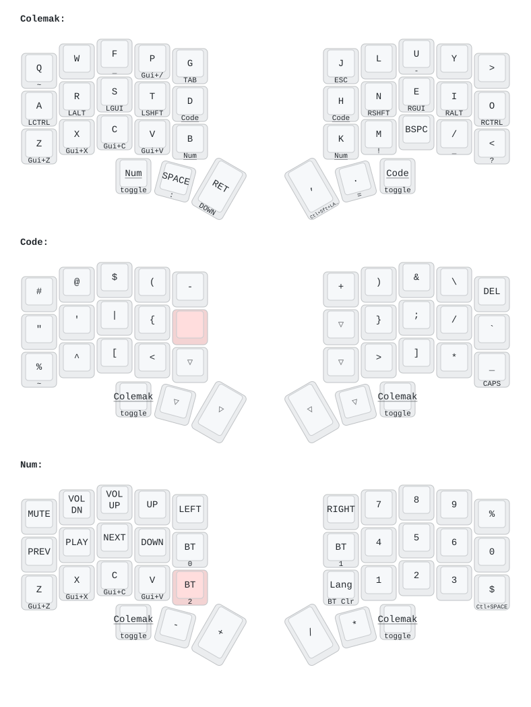

# Corne-ish Zen — Sakura

A **Colemak** 36-key layout for the wireless [Corne-ish Zen v2](https://lowprokb.ca/products/corne-ish-zen), tuned for **macOS**. It's a ZMK port of my QMK *Sakura* keymap (originally built for the beekeeb Piantor Pro), with home-row mods, tap-hold dual-function keys, chord combos, and on-board Bluetooth controls.

> Generated with [keymap-drawer](https://github.com/caksoylar/keymap-drawer). Big label = tap, small label = hold. Shaded keys are held to reach that layer.

---

## Layers

| Layer | How to reach it | Purpose |
|-------|-----------------|---------|
| **Colemak** (base) | default | Letters, home-row mods, thumb keys |
| **Code** | hold **D** or **H**, or tap the **Code** thumb | Symbols & punctuation |
| **Num** | hold **B** or **K**, or tap the **Num** thumb | Numpad, media, navigation, Bluetooth |

The `Num` / `Code` thumb keys **toggle** their layer (tap to switch, tap `Colemak` to return); holding `D`/`H`/`B`/`K` activates the layer momentarily.

---

## Home-row mods (Colemak base)

Hold a home-row key for its modifier; tap for the letter.

| Left | A | R | S | T | | Right | N | E | I | O |
|------|---|---|---|---|---|-------|---|---|---|---|
| **Hold** | Ctrl | Alt | Cmd | Shift | | **Hold** | Shift | Cmd | Alt | Ctrl |

---

## Tap-hold keys

| Key | Tap | Hold | | Key | Tap | Hold |
|-----|-----|------|---|-----|-----|------|
| Q | q | `~` | | M | m | `!` |
| F | f | `_` | | / | / | `_` |
| P | p | Cmd + / | | < | < | `?` |
| G | g | Tab | | Space | Space | `:` |
| J | j | Esc | | Enter | Enter | ↓ |
| U | u | `-` | | , | , | Meh (⌃⇧⌥) |
| Z / X / C / V | z/x/c/v | Cmd + Z/X/C/V | | . | . | `=` |
| % (Code) | % | `~` | | _ (Code) | _ | Caps Lock |
| $ (Num) | $ | Ctrl + Space | | **Lang** (Num) | lang switch | **clear BT (hold 400  ms)** |

The **Lang** key (`K` position on the Num layer): a quick tap sends the language switch (**Ctrl + Opt + Space**); a deliberate 400 ms hold clears the current Bluetooth profile's pairing.

---

## Combos

Press the listed keys together.

| Combo | Action |
|-------|--------|
| **Num** + **Code** thumbs | Language switch (Ctrl + Opt + Space) |
| **Q** + **A** + **Z** | Swipe to previous desktop (Ctrl + ←) |
| **>** + **O** + **<** | Swipe to next desktop (Ctrl + →) |
| **Num** + **Code** thumbs + **M** | Screenshot ⇧⌘1 |
| **Num** + **Code** thumbs + **Bspc** | Screenshot ⇧⌘2 |
| **Num** + **Code** thumbs + **Y** | Screenshot ⇧⌘9 |

---

## Bluetooth

On the **Num** layer (inner index columns):

| Key | Action |
|-----|--------|
| **BT0 / BT1 / BT2** | Select Bluetooth profile 0 / 1 / 2 (one per device) |
| **Lang** (hold 400 ms) | Clear the current profile's pairing, then re-pair from the OS |

Three profiles are bound; the Zen supports up to five if you need more.

---

## Build & flash

ZMK builds in the cloud via GitHub Actions — no local toolchain needed.

1. **Push** this repo to GitHub. Actions builds automatically on every push (see the **Actions** tab).
2. **Download** the `firmware` artifact from the finished run and unzip it. You'll get:
   - `corneish_zen_v2_left-zmk.uf2`
   - `corneish_zen_v2_right-zmk.uf2`
   - `corneish_zen_v2_left_with_studio-zmk.uf2` *(optional — left half with ZMK Studio enabled)*
3. **Flash** each half (one at a time, over USB-C):
   - Double-tap the **reset** button → a USB drive appears.
   - Drag the matching `.uf2` onto it (**left** file → left half, **right** file → right half). It reboots automatically.

The left half is the central that pairs to your Mac; the right half pairs to the left.

**Trouble pairing after a flash?** Flash a settings-reset image to **both** halves first, then re-flash left/right — this clears stale BLE bonds.

---

## Configuration

| File | What it controls |
|------|------------------|
| [`config/corneish_zen.keymap`](config/corneish_zen.keymap) | Keymap, behaviors, combos |
| [`config/corneish_zen.conf`](config/corneish_zen.conf) | Settings (e.g. idle-sleep timeout) |
| [`build.yaml`](build.yaml) | Which board variants to build |

Tap-hold timing: home-row mods and tap-dances use a 275 ms term (`tap-preferred`); layer-taps use `balanced`. Both are one-line tweaks at the top of the keymap.

---

*Based on the QMK Sakura keymap (beekeeb Piantor Pro). Built on the official [Corne-ish Zen ZMK config](https://github.com/Caksoylar/corneish_zen) · [ZMK Firmware](https://zmk.dev).*
